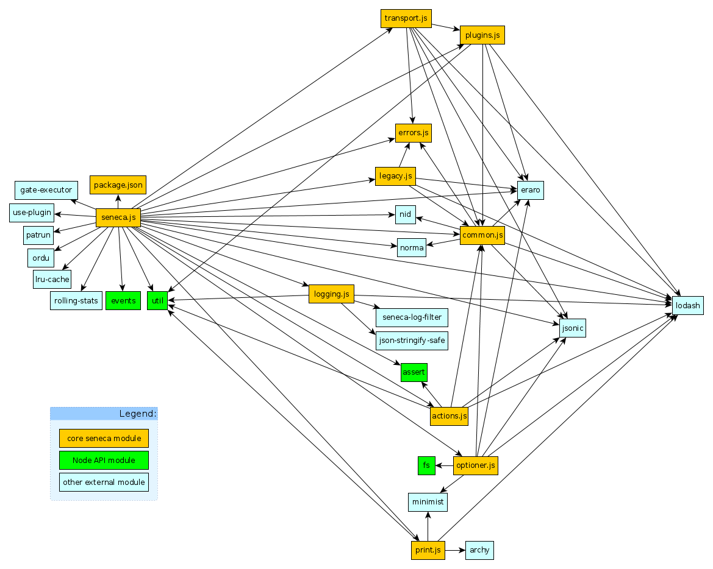

Seneca Internals
================

## Investigate and document:

- How are Seneca external and internal modules are organized, and how do they work?
- How are plugins managed?
- How does routing work?
- What are the decorators, and how to use them?
  (see: print.js/print_tree(), seneca.list(), ...)

## Modules and dependencies

The diagram below demonstrates the dependencies among the internal modules of seneca as well as their external dependencies:

The external modules used by Seneca.js:

- [Node API modules](https://nodejs.org/dist/latest-v7.x/docs/api/): [events](https://nodejs.org/api/events.html), [util](https://nodejs.org/api/util.html), [assert](https://nodejs.org/api/assert.html), [fs](https://nodejs.org/api/fs.html).
- [archy](https://github.com/substack/node-archy): render nested hierarchies `npm ls` style with unicode pipes.
- [eraro](https://github.com/rjrodger/eraro): Create JavaScript Error objects with code strings, context details, and templated messages.
- [gate-executor](https://github.com/rjrodger/gate-executor): A work queue that can be gated, stopping to wait for sub-queues to complete.
- [gex](https://github.com/rjrodger/gex):Glob expressions for JavaScript (referred only from package.json).
- [json-strigify-safe](https://github.com/e-conomic/safe-json-stringify): Prevent defined property getters from throwing errors.
- [jsonic](https://github.com/rjrodger/jsonic): A JSON parser that isn't strict.
- [lodash](https://github.com/lodash/lodash): Lodash modular utilities.
- [lru-cache](https://github.com/isaacs/node-lru-cache): A cache object that deletes the least-recently-used items.
- [minimist](https://github.com/substack/minimist): parse argument options.
- [nid](https://github.com/rjrodger/nid): Nice clean-mouthed random id generation, without any swearing!
- [norma](https://github.com/rjrodger/norma): A function argument organizer.
- [ordu](https://github.com/rjrodger/ordu): Execute functions in a configurable order, modifying a shared data structure.
- [patrun](https://github.com/rjrodger/patrun): A fast pattern matcher on JavaScript object properties.
- [rolling-stats](https://github.com/rjrodger/rolling-stats): Rolling statistics.
- [seneca-log-filter](https://github.com/senecajs/seneca-log-filter): Seneca log filtering module.
- [semver](https://github.com/npm/node-semver): The semantic version parser used by npm. (referred only from package.json).
- [use-plugin](https://github.com/rjrodger/use-plugin): Generic plugin loader functionality for Node.js frameworks.
